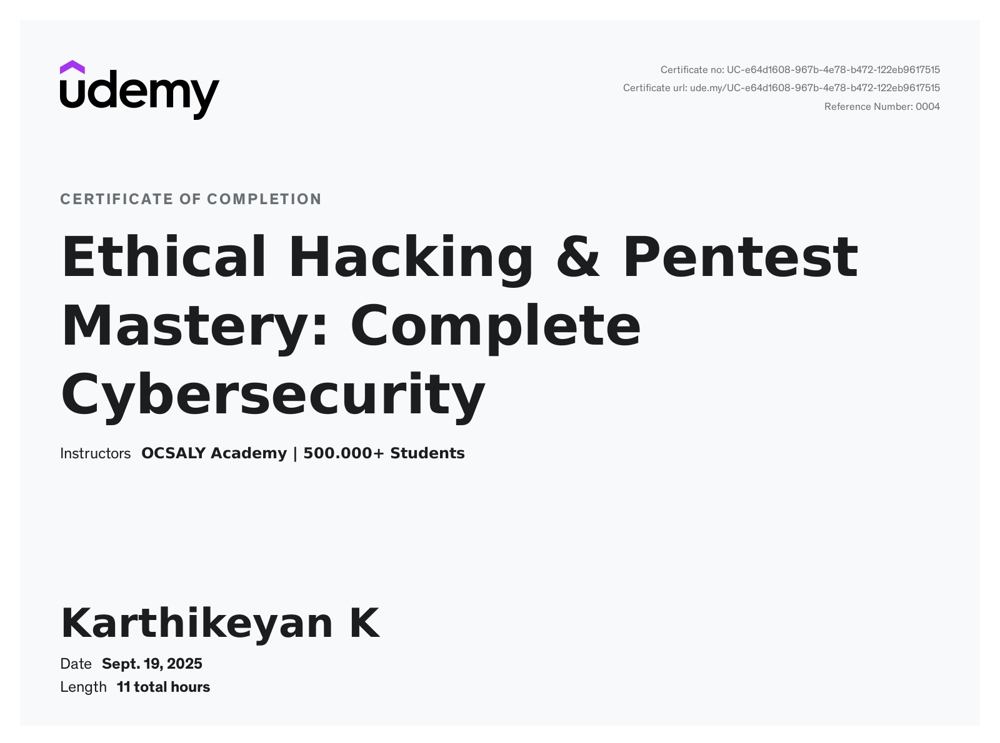
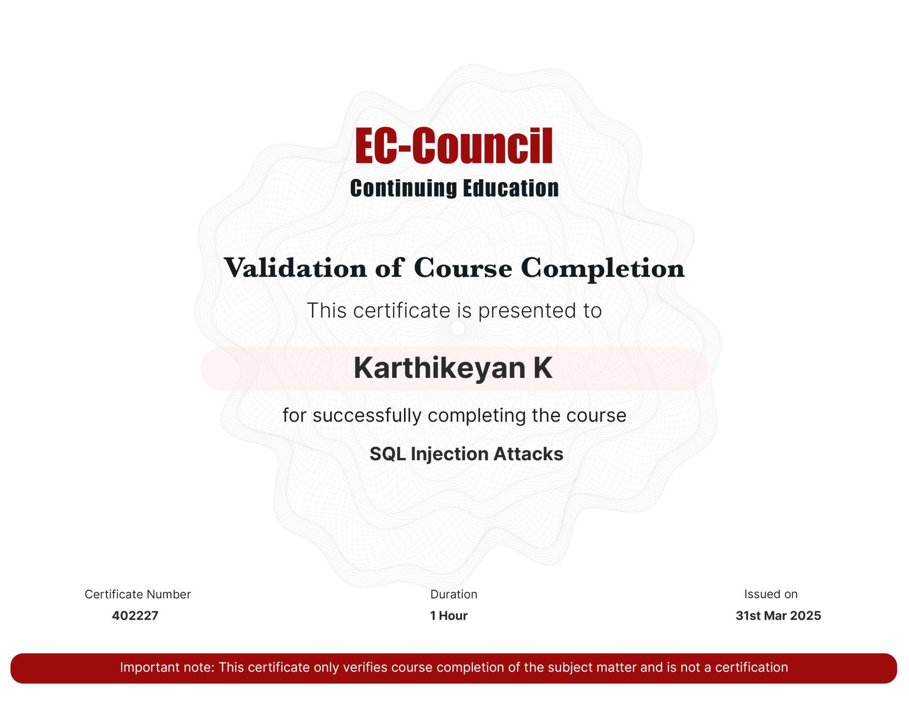

# Cybersecurity Certifications Portfolio

This repository showcases cybersecurity certifications, training programs, and professional learning achievements completed as part of my continuous journey in Cybersecurity, Penetration Testing, and Application Security.

---

## Certified LLM Security Professional (CLLMSP)

This certification provided practical knowledge of Large Language Model (LLM) security, AI threat modeling, prompt injection risks, secure AI deployment, and adversarial attack techniques.

### Skills Gained

- LLM Security Fundamentals
- Prompt Injection Testing
- AI Threat Modeling
- AI Application Security
- Secure AI Deployment
- Adversarial AI Concepts

### Certificate

---

## Certified Network Security Practitioner (CNSP)

The CNSP certification provided practical knowledge of network security fundamentals, threat identification, and defensive security concepts.

### Skills Gained
- Network Security
- Threat Analysis
- Security Controls
- Defensive Security

### Certificate

---

## Ethical Hacking & Pentest Mastery

Hands-on training focused on penetration testing methodologies, reconnaissance, vulnerability assessment, and web application security testing.

### Skills Gained
- Web Application Security
- OWASP Top 10
- Vulnerability Assessment
- Penetration Testing

### Certificate

---

## Security Analyst Certificate Program (NSDC)

Focused on cybersecurity operations, threat monitoring, incident response concepts, and security best practices.

### Skills Gained
- Security Operations
- Threat Detection
- Incident Response
- Security Monitoring

### Certificate

---

## Penetration Testing with Metasploit

Practical training on using Metasploit Framework for vulnerability validation and controlled security testing.

### Skills Gained
- Metasploit Framework
- Exploitation Basics
- Post Exploitation Concepts
- Security Testing

### Certificate

---

## SQL Injection Attacks – EC-Council

Focused on SQL Injection attack techniques, input validation weaknesses, and secure coding awareness.

### Skills Gained
- SQL Injection Testing
- Database Security
- Input Validation
- Web Security

### Certificate

---

## Python Programming – IIT Bombay

Provided foundational programming skills used in automation, scripting, and cybersecurity tool development.

### Skills Gained
- Python Programming
- Automation
- Scripting
- Problem Solving

### Certificate

---

## Continuous Learning

In addition to certifications, I actively improve my skills through:

- 80+ TryHackMe Labs
- PortSwigger Web Security Academy
- Security Research Activities
- NASA Vulnerability Disclosure Program
- Bug Bounty Programs
- Security Tool Development Projects

---

**Cybersecurity is a continuous learning journey, and these certifications represent milestones in developing practical security knowledge and hands-on skills.**
